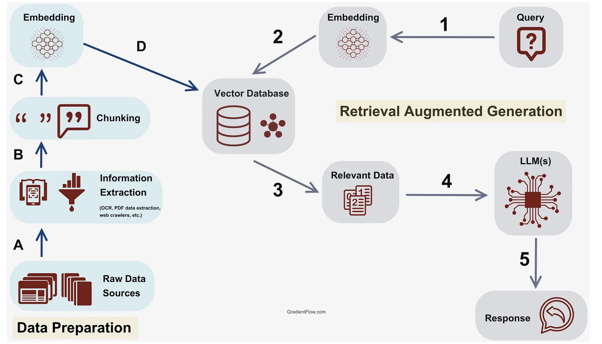

### Stock Research App
This project develops a stock research application that enables users to analyze and gain insights from stock-related articles.This innovative approach facilitates informed decision-making in the stock market, efficiently rather than going each article and read, analyze and then come to conclusion.

in short: Streamlit app for an AI Stock Researcher that processes stock articles and answers questions using RAG (Retrieval-Augmented Generation).

#### Create venv:
Create venv:
>   python3 -m venv .myvenv

Enter in venv (inside project directory)
>    source .myvenv/bin/activate

Deactivate
>    deactivate

#### Install the deps
> pip install -r requirements.txt

#### Run the streamlit app
> streamlit run main.py

### Test stock articles about Tata motors stock
1. https://www.moneycontrol.com/markets/financials/quarterly-results/tatamotorspassengervehicles-tm03/
2. https://groww.in/stocks/tata-motors-ltd/company-financial
3. https://www.indmoney.com/blog/stocks/tata-motors-q4-results

Output:[play](https://drive.google.com/file/d/1wjTHU7D-y446RGWc22m0EFwdzsNAsOTW/view)

### Workflow:

#### Processing Stock Articles
1. User enter stock article links
2. Load the web documents: Load the stock articles provided by the user.
3. Document splitting: Split the loaded documents into chunks.
4. Embedding: Generate embeddings for the text in each chunk using an embedding model.
5. FAISS index creation: Create a FAISS index from the embeddings and store it locally.

#### Answering user queries
1. Query is asked
2. Load the FAISS vector index.
3. Configure the retriever object to search for similar documents.
4. Set up a RAG chain with the retriever and a large language model (LLM).
5. Use the RAG chain to generate a response to the user's input.

## Key components/concepts used

### 1. Document Loader:
Provides the initial input for further processing, such as splitting and embedding.

### 2. Text Splitter: 
Breaks documents into manageable chunks for efficient processing and retrieval.

### 3. Embedding 
Embeddings convert text into numerical vectors for efficient search and retrieval (e.g., using HuggingFace's sentence-transformers). For example, HuggingFace's `all-MiniLM-L6-v2` model turns sentences into embeddings for document similarity search.
Embedding model: huggingface

### 4. RAG 
RAG (Retrieval-Augmented Generation) is an AI approach that integrates information retrieval (such as searching a database or document collection) with generative large language models (LLMs). Instead of relying solely on what the LLM "knows" from its pretraining, RAG first retrieves relevant external documents and then passes them, along with the user query, to the LLM. This enables the LLM to generate more up-to-date, accurate, and context-aware responses, especially when dealing with domain-specific or proprietary knowledge.

Retrieval => retrieve the external data (knowledge base)
Generation => generate more precise, informative, and engaging responses by combining the re knowledge base with LLM

### Alternatives for FAISS vector store
- Pinecone
- Chroma
- Weaviate

### Workflow architecture

